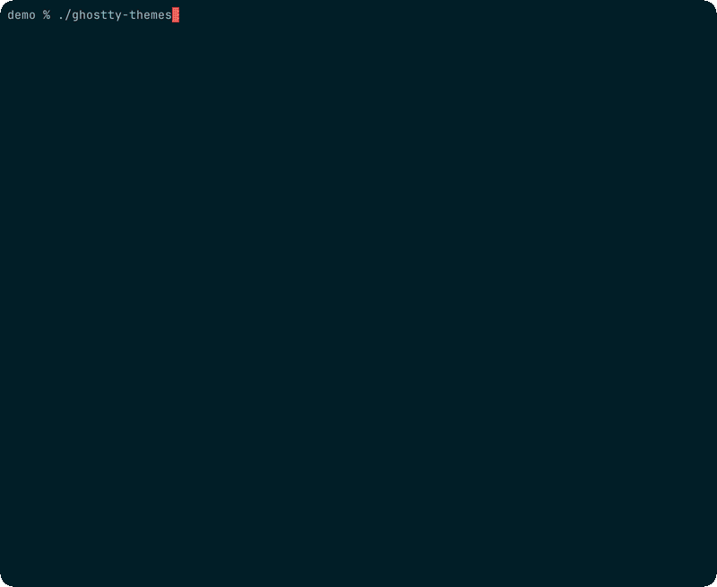

<div align="center">

# ghostty-themes

**[Ghostty](https://ghostty.org) 交互式主题选择器，支持实时预览、保存和跳过。**

[](#系统要求)
[](LICENSE)
[](https://ghostty.org)
[](https://github.com/junegunn/fzf)

[English](README.md) | **简体中文**

[功能](#功能) · [安装](#安装) · [使用](#使用) · [工作原理](#工作原理)

</div>

---

<p align="center">
  
  <br>
  <sub>真实交互录制：输入 <code>git</code>，用 <code>↑/↓</code> 浏览，在深浅主题间切换并各保存一个，再在两个已保存主题之间切换，跳过一个主题，最后应用当前选择。</sub>
</p>

## 功能

- **实时预览** — 浏览时主题即时应用到终端
- **Save 区** — `Ctrl-F` 保存当前主题，已保存主题固定在顶部
- **Skip 区** — `Ctrl-D` 跳过当前主题，已跳过主题沉到底部并带删除线标记
- **快速筛选** — Save / Skip 之后，焦点会继续停在下一个未标记主题上
- **代码预览面板** — 语法高亮的 Zig 代码、更明显的 16 色调色板 chips、文字样式，以及 selection / cursor 焦点 chips；整体更适合真实终端使用，同时尽量贴近 [`ghostty +list-themes`](https://github.com/ghostty-org/ghostty/blob/main/src/cli/list_themes.zig)
- **安全取消** — Esc / Ctrl-C 恢复原主题，不会误改配置
- **单文件** — 一个脚本，无需配置，无需编译

## 系统要求

- **macOS 13+**（Ventura 或更高版本）
- [Ghostty](https://ghostty.org) 1.0+
- [fzf](https://github.com/junegunn/fzf) 0.44+

```bash
brew install fzf    # 如果还没有安装 fzf
```

## 安装

**快速安装**（单文件，无需 git）：

```bash
mkdir -p ~/.local/bin
curl -fsSL https://raw.githubusercontent.com/flyerAI2025/ghostty-themes/main/ghostty-themes \
  -o ~/.local/bin/ghostty-themes && chmod +x ~/.local/bin/ghostty-themes
```

**或克隆仓库**（后续可通过 `git pull` 更新）：

```bash
git clone https://github.com/flyerAI2025/ghostty-themes.git
chmod +x ghostty-themes/ghostty-themes
mkdir -p ~/.local/bin
ln -sf "$(cd ghostty-themes && pwd)/ghostty-themes" ~/.local/bin/ghostty-themes
```

> 确保 `~/.local/bin` 在你的 `PATH` 中。如果不在，请在 `~/.zshrc` 中添加 `export PATH="$HOME/.local/bin:$PATH"` 并重启终端。

## 使用

```bash
ghostty-themes
```

| 按键 | 操作 |
|------|------|
| `↑` `↓` | 浏览主题 — **实时应用** |
| 输入文字 | 模糊搜索 / 过滤 |
| `Ctrl-F` | 保存 / 取消保存当前主题 |
| `Ctrl-D` | 跳过 / 取消跳过当前主题 |
| `Enter` | 确认选择 |
| `Esc` / `Ctrl-C` | 取消并恢复原主题 |

已保存主题显示在列表顶部；已跳过主题显示在列表底部，并带删除线标记。执行 Save / Skip 后，焦点会继续留在浏览区并前进到下一个未标记主题。

### 命令行

```bash
ghostty-themes --apply "Catppuccin Frappe"   # 直接应用指定主题
ghostty-themes --preview "Dracula"           # 渲染预览（fzf 内部调用）
ghostty-themes --list-saved                  # 列出已保存主题
ghostty-themes --save "Dracula"              # 保存主题
ghostty-themes --unsave "Dracula"            # 取消保存
ghostty-themes --list-skipped                # 列出已跳过主题
ghostty-themes --skip "Dracula"              # 跳过主题
ghostty-themes --unskip "Dracula"            # 取消跳过
ghostty-themes --help
```

兼容旧参数：`--list-fav`、`--add-fav`、`--rm-fav` 仍然可用。

### 配置

| 变量 | 默认值 | 说明 |
|------|--------|------|
| `GHOSTTY_CONFIG` | （自动检测） | 覆盖配置文件路径 |
| `GHOSTTY_THEMES_UI_MODE` | `auto` | 选择器布局模式：`auto`、`fullscreen` 或手动兜底用的 `panel` |
| `GHOSTTY_THEMES_RELOAD_MODE` | `auto` | 重载策略：`auto`、`script` 或 `shortcut` |

已保存主题保存在 `~/Library/Application Support/com.mitchellh.ghostty/theme-favorites`（纯文本、自动排序、每行一个主题名）。
已跳过主题保存在 `~/Library/Application Support/com.mitchellh.ghostty/theme-skipped`（纯文本、自动排序、每行一个主题名）。

`auto` 保持稳定的 fullscreen 布局。`panel` 作为手动兜底模式保留，适合个别对全屏 TUI 渲染不稳定的终端环境。
`auto` 重载模式会优先使用 Ghostty 的 AppleScript `reload_config` 动作；如果不可用，再回退到 `⌘⇧,` 快捷键。

## 工作原理

```
ghostty-themes
      │
      ▼
ghostty +list-themes ──▶ fzf ──▶ 选择主题
                          │          │
              --preview ──┘          │
              (用主题色渲染           ▼
               代码示例)          --apply
                                     │
                              ┌──────┴──────┐
                              │ 更新配置文件  │
                              │ + 重新加载    │
                              │ (优先         │
                              │  AppleScript) │
                              └─────────────┘
```

1. 通过 `ghostty +list-themes` 获取所有主题列表，然后拆分成 Saved、Browse、Skipped 三个区域
2. 传入 fzf，`--preview` 使用 ANSI 24-bit 真彩色渲染主题调色板 — 内容和[颜色映射](https://github.com/ghostty-org/ghostty/blob/main/src/cli/list_themes.zig)与 Ghostty 内置预览完全一致
3. 每次焦点切换时，更新配置文件中的 `theme = ...`，并优先通过 AppleScript `reload_config` 重新加载 Ghostty（`auto` 模式下才会回退到 `⌘⇧,`）
4. `Ctrl-F` 保存、`Ctrl-D` 跳过；两者都会即时写盘、立刻重排列表，并把焦点留在下一个未标记主题
5. Esc / Ctrl-C 恢复原主题；Enter 保留当前选择

## 常见问题

**`fzf not found`** — 执行 `brew install fzf` 安装。

**主题没有实时生效** — Ghostty 1.3+ 体验最佳，因为脚本可直接调用它的 AppleScript `reload_config` 动作。较旧环境可试试 `GHOSTTY_THEMES_RELOAD_MODE=shortcut ghostty-themes`。

**预览看起来是灰的** — `ghostty-themes` 会有意绕开全局 `NO_COLOR`，否则调色板 chips 和语法颜色会一起被压掉。如果你平时导出了 `NO_COLOR=1`，这里仍然显示颜色是预期行为。

**预览显示 "Theme not found"** — 请在 Ghostty 终端内运行（会自动设置 `GHOSTTY_RESOURCES_DIR`），或检查 Ghostty.app 是否在 `/Applications/` 目录下。

## 相关讨论

本工具回应了 Ghostty 社区中的多个长期需求：

- [Discussion #8145](https://github.com/ghostty-org/ghostty/discussions/8145) — "Write selected theme from +list-themes to disk"
- [Discussion #7221](https://github.com/ghostty-org/ghostty/discussions/7221) — "Action for switching themes"
- [Discussion #4261](https://github.com/ghostty-org/ghostty/discussions/4261) — "Select theme UI"

## 卸载

```bash
rm ~/.local/bin/ghostty-themes          # 删除符号链接
rm -rf <你克隆仓库的目录>                  # 例如 rm -rf ~/ghostty-themes
```

## 贡献

欢迎提交 Issue 和 PR。本项目仅支持 macOS。

仅维护者会用到 [`tools/demo`](tools/demo)：这里放的是重录 `demo.gif` 的脚本。

发布前可先跑一遍轻量回归测试：

```bash
./tests/smoke.zsh
```

`tests/smoke.zsh` 只用于验证列表分组、Save / Skip 焦点推进、配置写回和预览 ANSI 输出，不负责生成 `demo.gif`；演示动画会单独在真实 Ghostty GUI 会话里录制。普通最终用户日常使用 `ghostty-themes` 时，不需要关心 `tools/demo` 或 `tests/smoke.zsh`。

## 许可证

[MIT](LICENSE)
